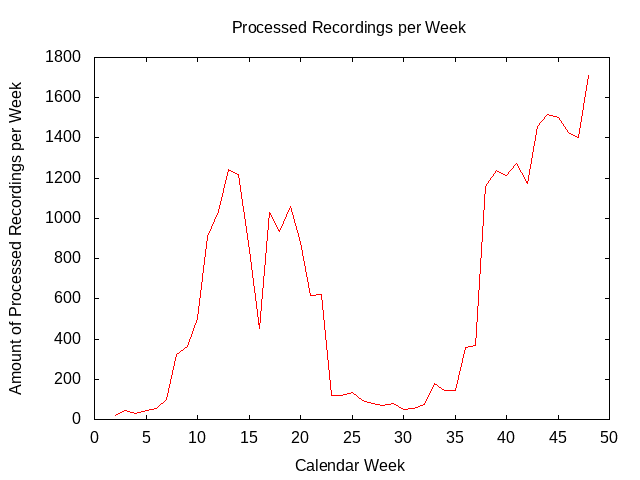

# README

With this script you can export and plot data on how many workflows ran in a week in a specified time frame.
This script works with multi-tenant systems.

### 1. Configure script in config.py

| Configuration Key      | Description                                                                       | Example                    |
| :--------------------- | :-------------------------------------------------------------------------------- | :------------------------- |
| `url`                  | The non-tenant-specific server URL                                                | https://opencast.com       |
| `url_pattern`          | Pattern for the tenant-specific server URL, leave empty for single-tenant systems | https://{}.opencast.com    |
| `digest_user`          | The user name of the digest user                                                  | opencast_system_account    |
| `digest_pw`            | The password of the digest user                                                   | CHANGE_ME                  |
| `workflow_definitions` | The ids of the workflow definitions to count                                      | ["ui-import", "api-import" |
| `exclude_tenants`      | The tenants to skip, if any                                                       | \["mh_default_org"\]       |
| `start_date`           | The date to start with\*                                                          | "2020-01-06"               |
| `end_date`             | The date to start with\*                                                          | "2020-11-29"               |
| `week_offset`          | The offset if the start date is not in the first calendar week                    | 1                          |
| `export_dir`           | The path to the directory for the exported data                                   | "data"                     |

&ast; Both of these dates should be the first day of the week for the statistics to be accurate.

### 2. Execute script

    `python main.py`

### 3. Adjust gnuplot script in plot.gp

### 4. Plot
   
    `gnuplot plot.gp`

### Optional: Plot tenant statistics

If you have a multi-tenant system, you can also plot their statistics into a single graph. For this, adjust 
`tenant_plot.gp` and then plot with `gnuplot tenant.gp`. Only tenants with at least one processed
recording in the specified time frame will be plotted. The order of tenants is determined by `filenames.txt` 
(default: tenants with most processed recordings first).

For gradual colors, uncomment the last line of `tenant_plot.gp`.

## Requirements

This script was written for Python 3.8. You can install the necessary packages with

`pip install -r requirements.txt`

Additionally, this script uses modules contained in the _lib_ directory.