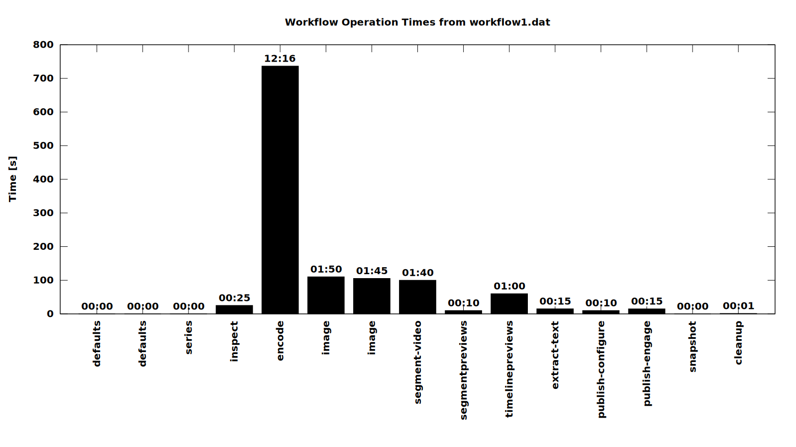
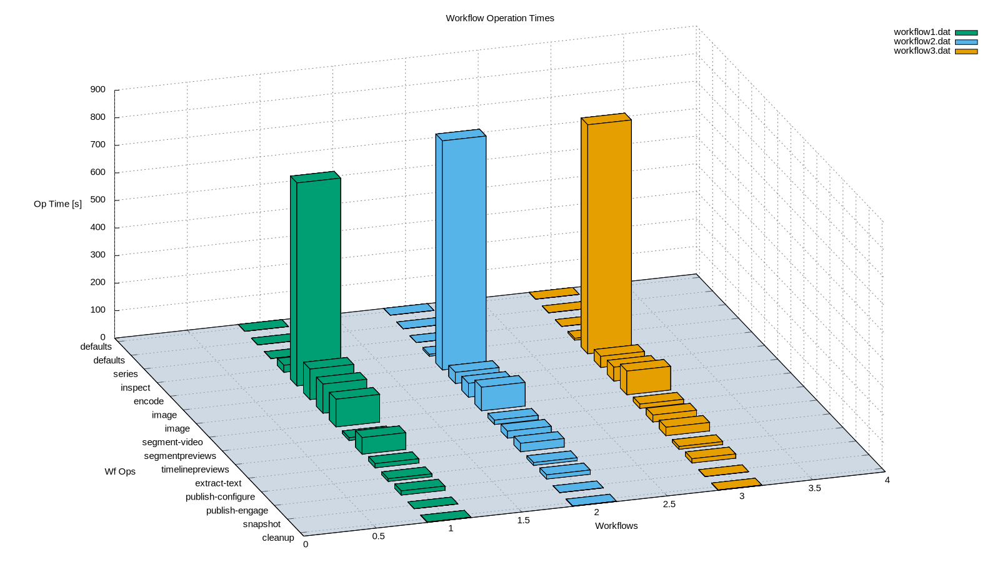

Visualize Workflows
===================

This is a simple tool for visualizing workflow operation processing times. It
helps you identify bottlenecks in your workflow by putting the processing time
of single operations into a visual context.

Usage
-----

First, set your system's location and digest login credentials in
`./get-workflow.sh`.

Then, get the identifier for the workflow you want to visualize from the event
details of Opencast's admin interface.

Finally, Run the tool-chain (this example uses the workflow identifier 1666):

```bash
./get-workflow.sh 1666
./prep-workflow.py
gnuplot plot-workflow.gnuplot
```

This will produce a `workflow.svg`.

Example Visualize Workflows chart:


Compare Workflows 3D Bar Chart
-----
A second plotting file provides visual comparison of multiple workflow instances of the same type of workflow in a 3D bar chart. It helps identify processing differences resulting from variable input file types using the same workflow.

This plot requires gnuplot v5.5+. The workflows being compared must have the **same** number and ordering of workflow operations. The 3D plotter cannot plot workflows that contain different operations or operations in a different order.

Usage
-----
Set your system's location and digest login credentials in
`./get-workflow.sh`.

Then, get the identifier for the workflows you want to visualize from the event details of Opencast's admin interface.

Then, modify the value of `WF_COUNT` to match the number of workflow instances to compare. The variable is located in both `./plot-mulit-workflow-3D.gnuplot` and `./plot-workflow.gnuplot`.

Finally, Run the tool-chain (substitute with real workflow identifiers):

```bash
./get-workflow.sh <wfId 1>
./get-workflow.sh <wfId 2>
./get-workflow.sh <wfId 3>
./get-workflow.sh <wfId 4>
./get-workflow.sh <wfId etc>
./prep-workflow.py
gnuplot plot-workflow.gnuplot
gnuplot plot-mulit-workflow-3D.gnuplot
```

This will produce a `workflow.svg` and a `workflows-3D.svg`

The HTML helper file can be used to display the new SVG files, `./viewSvg.html`.


Example Compare Workflows chart:
